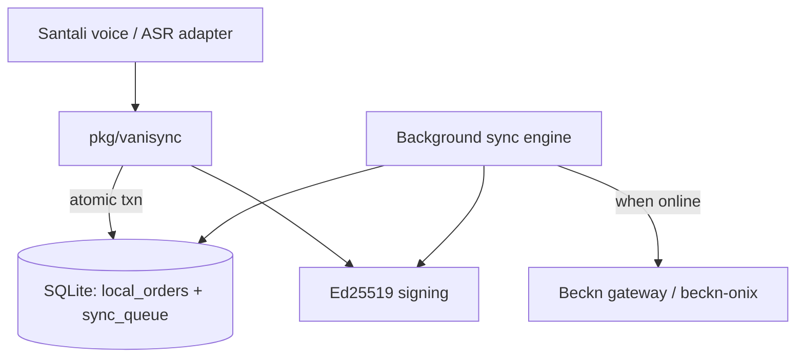

# VaniSync-Beckn Gateway Library

**Offline-first Beckn/ONDC gateway SDK** for rural retail in **Santhal Pargana (Dumka, Jharkhand)**. Merchants and Village Level Entrepreneurs (VLEs) can confirm retail orders without waiting for mobile signal; the SDK commits locally to SQLite and relays signed Beckn messages when connectivity returns.

Built for Common Service Centre (CSC) deployments where **2G dropouts and power cuts** are routine—not edge cases.

**Module:** `github.com/sharanyashwant27-tech/vanisync-beckn`

---

## Why Dumka / offline-first?

Dumka district sits in a **low-connectivity, multilingual** region. Many shopkeepers prefer **Santali** (Ol Chiki) over typed Hindi or English. VaniSync-Beckn assumes:

- The merchant must see **immediate local confirmation** even when the Beckn gateway is unreachable.
- **No order loss** after the UI shows success—durability is non-negotiable.
- Sync to ONDC/Beckn is **eventual**, ordered, and **idempotent**.

The core pattern is the **transactional outbox**: domain data and relay queue rows commit in **one SQL transaction**; a background engine POSTs FIFO when the network is up.

---

## Architecture (summary)



| Layer | Responsibility |
|-------|----------------|
| `pkg/vanisync` | Public API — confirm order, start sync |
| `internal/outbox` | Atomic write: order + outbox |
| `internal/sync` | FIFO relay, IN_FLIGHT recovery, retry/backoff |
| `internal/beckn` | Retail confirm JSON, signature headers |
| `internal/crypto` | Ed25519 key management (persistent key file) |
| `internal/voice` | ASR interface (Bhashini stub in v1) |

**Formal model:** [specs/VaniSyncOutbox.tla](specs/VaniSyncOutbox.tla) proves safety (`NoOrphans`) and liveness (`EventualConsistency`) for the outbox relay.

**Full documentation:** [docs/architecture/](docs/architecture/)

---

## Repository layout

```
├── docs/architecture/     ISO 42010 views + ADRs
├── specs/                 TLA+ outbox specification
├── internal/              Go implementation (MVP)
├── pkg/vanisync/          Public SDK surface
├── cmd/migrate/           SQLite migration runner
├── migrations/            SQLite schema
├── test/refinement/       TLA+ ↔ Go invariant tests (abstract + real store/sync)
├── test/integration/      beckn/starter-kit sandbox (Docker, opt-in)
├── docker/                beckn/starter-kit integration stub
└── .cursor/               Agent rules + MCP (SQLite, filesystem)
```

---

## Local development quickstart

### Prerequisites

- **Go 1.22+**
- **Java 11+** and [tla2tools.jar](https://github.com/tlaplus/tlaplus/releases) (for formal verification)
- **Node.js / npx** (optional — for Cursor MCP SQLite/filesystem servers)
- **Docker** (optional — beckn/starter-kit sandbox)

### 1. Clone and enter the repo

```bash
git clone https://github.com/sharanyashwant27-tech/VaniSync-Beckn-Gateway-Library.git
cd VaniSync-Beckn-Gateway-Library
```

### 2. Run tests

```bash
make test
# or: go test ./...
```

CI runs the same suite on every push to `main` via [`.github/workflows/go-test.yml`](.github/workflows/go-test.yml).

### 3. Prepare local SQLite and signing key

```bash
mkdir -p data
make migrate
# Database: ./data/vanisync.db (override with DB_PATH=...)
# Ed25519 key: ./data/ed25519.key (auto-created on first Client.New)
```

### 4. Verify the TLA+ outbox model

Download `tla2tools.jar` and run:

```bash
# Unix
export TLA2TOOLS=/path/to/tla2tools.jar
make tla-check

# Windows (PowerShell)
$env:TLA2TOOLS = "C:\path\to\tla2tools.jar"
make tla-check
```

Expected: TLC completes with no invariant violation for the bounded config (`OrderIds = {o1, o2, o3}`).

### 5. Cursor MCP (optional)

Project config lives in [`.cursor/mcp.json`](.cursor/mcp.json):

- **filesystem** — project root access for agents
- **sqlite** — `./data/vanisync.db` for inspecting orders and outbox rows

Restart Cursor after editing MCP config. On Windows, if the SQLite server fails to open a relative path, set `--db-path` to an absolute path in `mcp.json`.

### 6. beckn/starter-kit sandbox (optional)

Integration tests live in [`test/integration/`](test/integration/) and skip unless Docker is available and `VANISYNC_INTEGRATION=1` is set. See commented stub in [`docker/compose.starter-kit.yml`](docker/compose.starter-kit.yml).

---

## Engineering constraints

Enforced via [`.cursor/rules/vanisync-beckn.mdc`](.cursor/rules/vanisync-beckn.mdc):

- Atomic outbox — one transaction for domain + queue
- **No network I/O** in business handlers
- Sign payloads **before** outbox insert (Ed25519, base64 on wire)
- FIFO sync queue with single in-flight message and stale IN_FLIGHT recovery
- `context.Context` first parameter; `log/slog` for logging

---

## MVP success criteria

| Criterion | Status |
|-----------|--------|
| `ConfirmRetailOrder` writes order + outbox atomically in SQLite | Done |
| Sync engine relays FIFO with signed idempotency key when network is up | Done |
| Network drop does not lose or duplicate orders (refinement tests pass) | Done |
| Go-level refinement tests exercise real store + sync sequences | Done |
| IN_FLIGHT crash recovery and single in-flight enforcement | Done |
| Persistent Ed25519 key file under `data/` (configurable) | Done |
| TLC model runs without invariant violation (bounded state space) | Done (local `make tla-check`) |
| `.cursor/rules` constraints documented; CI runs `go test ./...` | Done |
| README documents Dumka rationale and local dev quickstart | Done |
| beckn/starter-kit end-to-end integration | Scaffold only (Docker opt-in) |

---

## Status

| Phase | Scope | Status |
|-------|-------|--------|
| 1 | Architecture docs, ADRs, Cursor workspace | Done |
| 2 | TLA+ spec + `make tla-check` | Done |
| 3 | Go core — store, outbox, sync, `pkg/vanisync` | **MVP complete** |
| 4 | Refinement tests, starter-kit integration | Refinement done; integration scaffold |

---

## References

- [Beckn Protocol](https://becknprotocol.io/)
- [beckn-onix](https://github.com/beckn/beckn-onix) — signature patterns
- [beckn/starter-kit](https://github.com/beckn/starter-kit) — integration sandbox
- [ADR-001: Transactional Outbox](docs/architecture/adr/ADR-001-transactional-outbox.md)

---

## License

TBD
