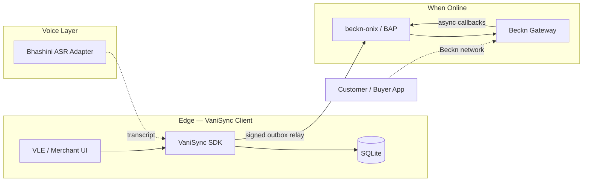

# System Overview — VaniSync-Beckn Gateway Library

**Document:** 01-system-overview  
**Standard:** ISO/IEC/IEEE 42010  
**Status:** Draft (Phase 1 baseline)  
**Last updated:** 2026-06-17

---

## 1. Environment of Interest (EoI)

VaniSync-Beckn is a **Go SDK and edge gateway library** that lets rural retail operators in **Santhal Pargana (Dumka district, Jharkhand)** accept and record Beckn/ONDC retail orders **while offline**, then relay signed messages to a Beckn gateway when connectivity returns.

The EoI spans:

| Boundary | Inside EoI | Outside EoI |
|----------|------------|-------------|
| Edge device | VaniSync client, SQLite store, sync engine, Ed25519 signing, voice→intent adapter | Merchant ERP, payment rails |
| Network | Outbox relay, retry/backoff, Beckn HTTP adapter | ISP quality, DNS, CDN |
| Gateway | Signed message format, idempotency keys | Beckn registry, BPP catalog, settlement |

**Primary domain (v1):** Local retail / ONDC — `confirm` and related BAP actions.

**Deployment context:** Common Service Centres (CSCs), Village Level Entrepreneurs (VLEs), and small kirana shops where **intermittent 2G/3G** and **power outages** are normal. Operators may prefer **Santali voice input** (Ol Chiki script via ASR) over typed Hindi/English forms.

---

## 2. System Purpose

1. **Capture orders locally** with immediate UI feedback — no blocking on network round-trips.
2. **Guarantee durability** via atomic domain write + transactional outbox in one SQLite transaction.
3. **Relay Beckn-compliant, signed payloads** FIFO when the network is available.
4. **Support multilingual, voice-first UX** through a pluggable ASR adapter (Bhashini path deferred to Phase 4).

---

## 3. Quality Attributes

| Attribute | Target (v1) | Mechanism |
|-----------|-------------|-----------|
| Offline resilience | Orders never lost on device crash after commit | SQLite WAL + single txn outbox |
| Idempotency | Gateway deduplicates retries | Signed UUID per outbox row |
| Consistency | No orphan server records | Safety invariant (TLA+ `NoOrphans`) |
| Eventual sync | All committed orders reach gateway when network stable | FIFO sync engine + liveness property |
| Beckn alignment | Retail BAP path compatible with beckn-onix | Shared signature header patterns |
| Operability | Debuggable on low-end Android/Linux edge | Structured `slog` logging |

---

## 4. Context Diagram

---

## 5. Scope and Deferrals (v1)

**In scope**

- Transactional outbox for retail `confirm`
- Ed25519 signing before queueing
- Background sync engine with exponential backoff
- Formal TLA+ model (`specs/VaniSyncOutbox.tla`)
- ISO 42010 views and ADRs in this directory

**Explicitly deferred**

- Full Bhashini telephony integration
- HashiCorp Vault production key management
- CRDT multi-writer conflict resolution
- DHP / open-agri Beckn domains
- Production Redis/RabbitMQ message bus

---

## 6. Related Documents

| Document | Description |
|----------|-------------|
| [02-stakeholders-concerns.md](./02-stakeholders-concerns.md) | Stakeholders and architecture drivers |
| [03-structural-view.md](./03-structural-view.md) | Modules, packages, data stores |
| [04-sync-behavioral-view.md](./04-sync-behavioral-view.md) | Sync flows, OCC, failure modes |
| [adr/](./adr/) | Architecture Decision Records |
| [../../specs/VaniSyncOutbox.tla](../../specs/VaniSyncOutbox.tla) | Formal outbox model |
