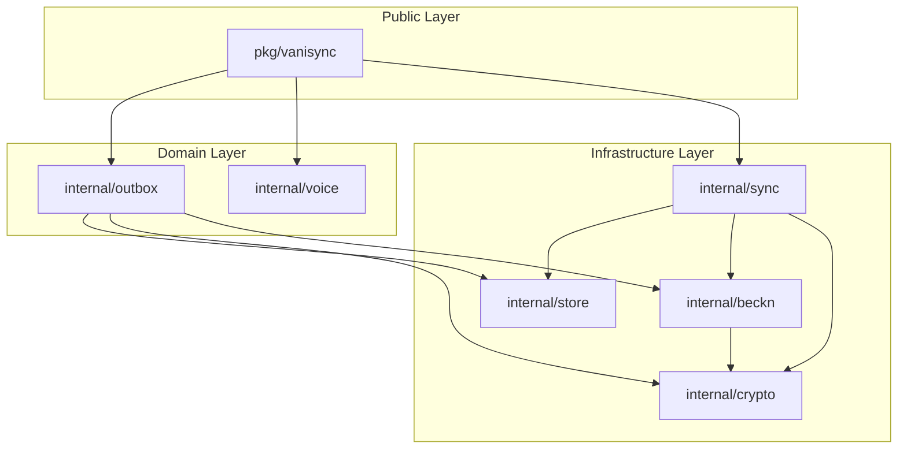

# Structural View — VaniSync-Beckn

**Document:** 03-structural-view  
**Standard:** ISO/IEC/IEEE 42010  
**Status:** Draft (Phase 1 baseline)

---

## 1. Repository Structure

```
VaniSync-Beckn-Gateway-Library/
├── pkg/vanisync/          # Public SDK (ConfirmOrder, Start sync)
├── internal/
│   ├── store/             # SQLite open, migrations, transactions
│   ├── outbox/            # Atomic domain + outbox writes
│   ├── sync/              # Background engine, probe, backoff
│   ├── beckn/             # Retail schemas, relay client, signatures
│   ├── crypto/            # Ed25519 SimpleKeyManager
│   └── voice/             # ASRProvider interface + stub
├── migrations/            # SQL schema versions
├── specs/                 # TLA+ formal model
├── docs/architecture/     # This documentation set
├── test/refinement/       # TLA+ ↔ Go invariant tests
└── docker/                # starter-kit integration stub
```

---

## 2. Layered Module Diagram



**Dependency rule:** `pkg/vanisync` must not import `internal/sync` implementation details beyond constructor wiring. No package in `internal/` imports `pkg/vanisync`.

---

## 3. Package Responsibilities

| Package | Responsibility | Key types (planned) |
|---------|----------------|---------------------|
| `pkg/vanisync` | Public client API, lifecycle (`Start`, `Stop`) | `Client`, `ConfirmOrderRequest` |
| `internal/store` | DB pool, migrations, `WithTx` | `Store`, `Tx` |
| `internal/outbox` | Single-txn write path | `WriteOrderWithOutbox` |
| `internal/crypto` | Key load/generate, sign bytes | `SimpleKeyManager` |
| `internal/beckn` | Retail JSON builders, `RelayClient` | `ConfirmPayload`, `SignatureHeader` |
| `internal/sync` | FIFO poll, relay, status updates | `Engine`, `NetworkProbe` |
| `internal/voice` | ASR abstraction | `ASRProvider`, `StubASRProvider` |

---

## 4. Data Stores (SQLite)

### 4.1 `local_orders`

Domain table for retail orders on the edge device.

| Column | Type | Notes |
|--------|------|-------|
| `id` | TEXT PK | Local order UUID |
| `beckn_action` | TEXT | e.g. `confirm` |
| `payload_json` | TEXT | Canonical Beckn body |
| `status` | TEXT | `PENDING` \| `SYNCED` \| `FAILED` |
| `updated_at` | INTEGER | Unix ms — OCC version |
| `created_at` | INTEGER | Unix ms |

### 4.2 `sync_queue` (Transactional Outbox)

| Column | Type | Notes |
|--------|------|-------|
| `id` | TEXT PK | Signed idempotency UUID |
| `aggregate_id` | TEXT | FK → `local_orders.id` |
| `payload_json` | TEXT | Beckn request (pre-signed content) |
| `signature` | TEXT | Ed25519 base64 |
| `status` | TEXT | `PENDING` \| `IN_FLIGHT` \| `SENT` \| `FAILED` |
| `attempt_count` | INTEGER | Retry counter |
| `created_at` | INTEGER | FIFO ordering |

**Index:** `idx_sync_queue_pending ON sync_queue(status, created_at)`

---

## 5. TLA+ ↔ Go Refinement Mapping

| TLA+ variable | Go implementation |
|---------------|-------------------|
| `clientDB` | `map[string]*Order` / `local_orders` rows |
| `outbox` | `sync_queue` pending slice |
| `network` | In-flight relay buffer in sync engine |
| `serverDB` | Mock gateway state (tests) / gateway DB |
| `networkActive` | `NetworkProbe.IsUp()` |

See [specs/VaniSyncOutbox.tla](../../specs/VaniSyncOutbox.tla).

---

## 6. External Systems

| System | Integration point | Protocol |
|--------|-------------------|----------|
| Beckn gateway | `internal/beckn.RelayClient` | HTTPS + `X-Gateway-Signature` |
| beckn-onix | Reference signature validation | Header format parity |
| beckn/starter-kit | `docker/compose.starter-kit.yml` | Docker sandbox (Phase 4) |
| Bhashini ASR | `internal/voice.ASRProvider` | HTTP/gRPC (stub in v1) |

---

## 7. Cross-Cutting Concerns

| Concern | Location |
|---------|----------|
| Logging | `log/slog` in all packages; context-carried logger |
| Context | `context.Context` as first parameter on all I/O |
| Migrations | `migrations/*.sql` applied at `Store.Open` |
| Agent tooling | `.cursor/mcp.json` — filesystem + SQLite MCP |

Enforced in [.cursor/rules/vanisync-beckn.mdc](../../.cursor/rules/vanisync-beckn.mdc).
