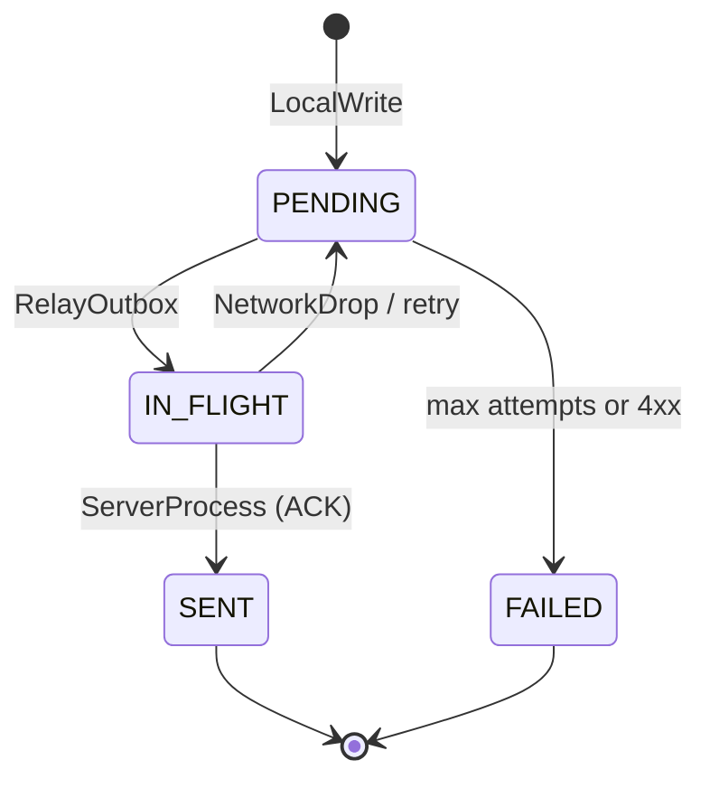

# Sync Behavioral View — VaniSync-Beckn

**Document:** 04-sync-behavioral-view  
**Standard:** ISO/IEC/IEEE 42010  
**Status:** Draft (Phase 1 baseline)

---

## 1. Overview

This view describes **runtime behavior** of the offline-first sync path: local write, outbox relay, network failure, and server-side processing. It aligns with the TLA+ actions `LocalWrite`, `RelayOutbox`, `NetworkDrop`, and `ServerProcess`.

---

## 2. Happy Path — Confirm Order While Offline

```mermaid
sequenceDiagram
    participant UI as Merchant UI
    participant API as pkg/vanisync
    participant OUT as internal/outbox
    participant DB as SQLite
    participant ENG as sync.Engine
    participant GW as Beckn Gateway

    UI->>API: ConfirmRetailOrder(ctx, req)
    API->>OUT: Build Beckn payload + sign
    OUT->>DB: BEGIN; INSERT local_orders; INSERT sync_queue; COMMIT
    DB-->>API: OK
    API-->>UI: LocalOrder (status=PENDING)

    Note over ENG,GW: Later, when network up
    ENG->>DB: SELECT oldest PENDING from sync_queue
    ENG->>DB: UPDATE status IN_FLIGHT
    ENG->>GW: POST signed payload (idempotency key)
    GW-->>ENG: 200 ACK
    ENG->>DB: UPDATE sync_queue SENT; local_orders SYNCED
```

**Invariant:** Steps between the two INSERTs and COMMIT are atomic — no order without outbox row, and vice versa.

---

## 3. Sync Engine Loop

The engine runs in a goroutine started by `Client.Start(ctx)`:

```
loop until ctx cancelled:
  if not networkActive:
    sleep(probe_interval)
    continue

  row := dequeue oldest sync_queue WHERE status = 'PENDING' ORDER BY created_at ASC
  if row is nil:
    sleep(idle_interval)
    continue

  mark row IN_FLIGHT
  resp := relay.Post(ctx, row.payload, row.signature, row.id)

  if resp.success:
    mark row SENT, order SYNCED
  else:
    increment attempt_count
    if attempt_count >= max_attempts (default 10):
      mark sync_queue FAILED and local_orders FAILED
    else:
      mark row PENDING
      sleep(backoff(attempt_count))
```

**Implementation (v1):** `sync.Engine` defaults `max_attempts` to **10**. Gateway **4xx** responses are treated as non-retryable and immediately mark `FAILED`. **5xx** and transport errors retry with exponential backoff until the cap.

**FIFO guarantee:** Only one in-flight message per device in v1; strict ordering by `created_at`.

---

## 4. Failure Modes

| Event | TLA+ action | System behavior |
|-------|-------------|-----------------|
| Network down during handler | N/A (no network in handler) | Order still commits locally |
| Relay timeout | `NetworkDrop` | Row returns to `PENDING`; retry with backoff |
| Gateway 5xx | `NetworkDrop` | Same as timeout; idempotency key prevents duplicate side effects |
| Gateway 4xx (non-retryable) | — | Mark `FAILED`; surface to operator |
| Device crash after COMMIT | — | Outbox row survives; engine resumes on restart |
| Device crash during txn | — | SQLite rollback; no partial order |

---

## 5. Network Drop and Retry (Behavioral Detail)

When the sync engine POST fails or times out:

1. Transaction: set `sync_queue.status = 'PENDING'`, increment `attempt_count`.
2. Do **not** delete the outbox row until gateway ACK.
3. Exponential backoff: `min(cap, base * 2^attempt)` seconds.
4. Re-use the **same** idempotency UUID and signature on retry.

This matches the TLA+ model where `NetworkDrop` returns the in-flight message to the outbox tail for eventual relay.

---

## 6. Optimistic Concurrency (OCC) — v1

**Model:** Single writer per device; conflicts arise when the **server** has a newer version (e.g. operator also edited via web dashboard).

**Client metadata:** Every payload includes `updated_at` (Unix ms) from `local_orders`.

**Server-side trigger (reference — PostgreSQL at gateway):**

```sql
CREATE OR REPLACE FUNCTION apply_retail_confirm()
RETURNS TRIGGER AS $$
BEGIN
  IF EXISTS (
    SELECT 1 FROM server_orders
    WHERE id = NEW.id AND updated_at > NEW.updated_at
  ) THEN
    RAISE EXCEPTION 'stale_write: client version % < server %',
      NEW.updated_at, (SELECT updated_at FROM server_orders WHERE id = NEW.id);
  END IF;
  RETURN NEW;
END;
$$ LANGUAGE plpgsql;
```

**Edge behavior on stale rejection:**

- Mark local order `FAILED` with reason `stale_write`.
- Operator resolves manually (v1); CRDT merge deferred to v2.

---

## 7. Formal Properties

| Property | Type | Definition |
|----------|------|------------|
| **NoOrphans** | Safety | Every ID in `serverDB` exists in `clientDB` |
| **EventualConsistency** | Liveness | When `networkActive` and queues empty, `serverDB = clientDB` |
| **AtomicWrite** | Safety | `LocalWrite` adds to `clientDB` and `outbox` together |

Verified in [specs/VaniSyncOutbox.tla](../../specs/VaniSyncOutbox.tla) via TLC and in `test/refinement/` via `testing/quick`.

---

## 8. Beckn Callback Path (Async)

Gateway callbacks (e.g. `on_status`) are **out of scope** for the outbox write path in v1. They arrive via:

1. `beckn-onix` webhook → application handler.
2. Handler updates local read-model (separate txn; no outbox unless downstream action required).

Documented here to clarify that **BAP confirm outbox** is the primary sync behavioral concern for MVP.

---

## 9. State Machine — `sync_queue.status`


